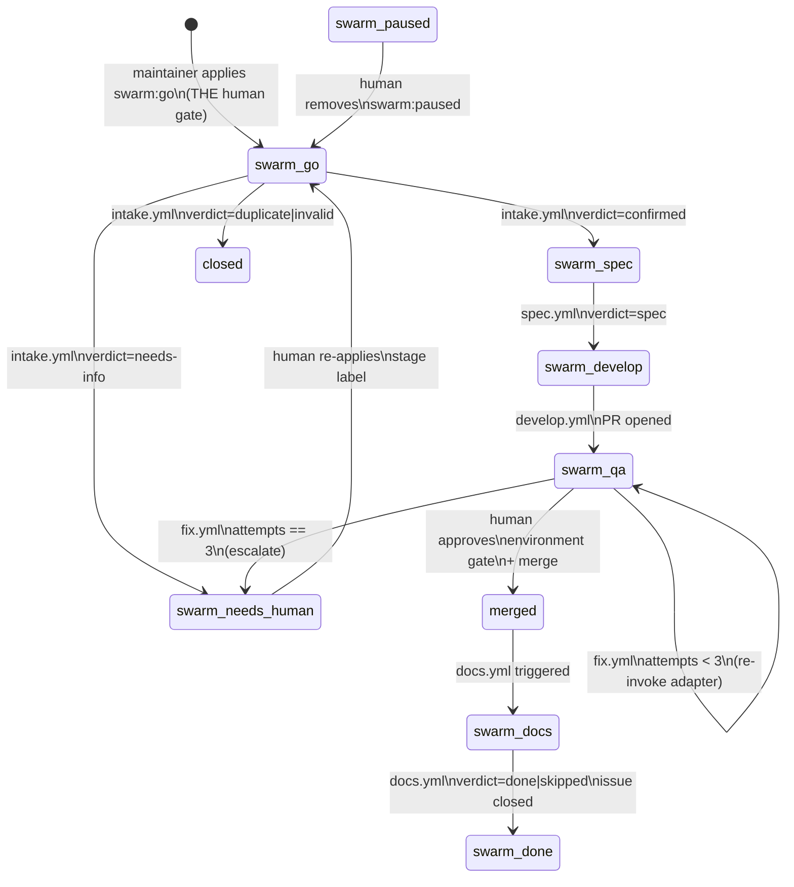

# swarm — Architecture

## 1. Design thesis: stigmergy

Swarm's organizing principle comes from swarm biology: *stigmergy* — decentralized coordination through traces left in a shared environment. Ant colonies navigate without a central planner; each individual reads the pheromone state and deposits its own trace.

The central failure mode of Daedalus/Hermes was the inverse: agents owned state (a local `kanban.db`), communicated through free text (a kanban-card comment protocol), and a single corrupt card or missed cron could wedge the entire pipeline. Recovery required human database surgery.

Swarm externalizes all state to GitHub. Labels are the pheromone trail. Actions events are the environment triggers. A failing agent produces a schema-validation error and a failed job — the pipeline stops, the fix loop engages, and the state in GitHub is always coherent. No sidecar databases. No daemon processes. No local state files.

---

## 2. State machine

### 2.1 Label states and transitions

One `swarm:*` stage label per issue at a time. The `transition` composite action is the sole writer of stage labels: it removes the old label, adds the new one, posts a transition comment, and calls `notify` — atomically from the perspective of GitHub state.



Auxiliary labels:
- `swarm:needs-human` — terminal until a human acts.
- `swarm:attempts:1`, `swarm:attempts:2`, `swarm:attempts:3` — fix-loop counters, managed exclusively by `bump-attempts`.
- `swarm:paused` — human or sweeper parking; the sweeper never adds or removes this label.

> **Cascade dependency:** each stage-label write must be authored by a distinct actor (`SWARM_TOKEN` PAT) — not `GITHUB_TOKEN`. GitHub's recursion guard silently suppresses workflow triggers for events authored by the built-in runner token, which would stall the cascade at the first automated stage. See `docs/adopting.md#swarm-token` for required PAT scopes.

> **Merge gate (implemented in `pr-gates.yml` — #48):** the `swarm_qa → merged` transition shown above is enforced by the `merge` job in `pr-gates.yml` (`environment: swarm-approval`). After `reviewer-post` and `security-post` complete, the job pauses for a human "Review deployments" approval in the Actions UI. On approval, pre-merge verification runs (`review:approved` label present, no `swarm:needs-human` on the issue, all completed check-runs green), then squash-merges via `SWARM_TOKEN` and transitions the issue to `swarm:docs`. Prior to #48, nothing in the pipeline performed the merge — the state diagram described intent, not enforcement.

---

## 3. Workflows

All seven workflows are `on: workflow_call` — they have no self-contained triggers. The consumer repo's caller workflow owns the triggers and pins swarm at `@v1`.

| Workflow | Trigger (in caller) | Agent role | Output |
|---|---|---|---|
| `intake.yml` | issue labeled `swarm:go` | validator | verdict: confirmed / duplicate / invalid / needs-info |
| `spec.yml` | issue labeled `swarm:spec` | pm | spec comment + `docs/specs/issue-N.md` on feature branch |
| `develop.yml` | issue labeled `swarm:develop` | `claude-code-action` or `headless` | branch `swarm/issue-N` + open PR |
| `pr-gates.yml` | pull_request on swarm branches | reviewer, security (parallel) | PR review + required check pass/fail |
| `fix.yml` | check failure on swarm PR | develop adapter (re-invoked) | bump attempt counter; escalate at 3 |
| `docs.yml` | PR merged (swarm branch) | docs | transition `swarm:docs → swarm:done`; issue closed |
| `sweeper.yml` | schedule (cron in caller) + workflow_dispatch | orchestrator | stuck-issue report; `swarm:needs-human` on escalate |

**Sweeper note:** the `schedule:` trigger lives in the consumer caller workflow, not in `sweeper.yml`. The sweeper is invoked via `workflow_call` from the caller's `schedule:` job.

**Concurrency:** every issue-scoped job declares `concurrency: swarm-<issue> / cancel-in-progress: false`. This prevents duplicate runs for the same issue without cancelling an already-running job.

**Engine asset resolution:** every job that invokes engine actions, prompts, or scripts runs a SHA-pinned `actions/checkout` into `path: .swarm-engine` before any engine step. All `uses:` directives and script paths reference `.swarm-engine/…` — not workspace-relative paths. The `engine-repo` and `engine-ref` workflow inputs (defaults: `benmarte/swarm` / `v1`) let callers pin an independent engine version.

**Findings comments:** after each stage completes, the pipeline posts a findings comment sourced from evidence fields in the agent's validated `outcome.json`. `intake.yml` (validator) posts a `validator-verdict` comment on the issue for every verdict. `develop.yml` posts a `pr-opened` comment on the issue after the PR is created. `pr-gates.yml` posts a `review-signoff` comment on the PR (reviewer job) and a `security-signoff` comment on the PR (security job); when security verdict is `fail`, an additional `blocked` comment is also posted on the issue. `docs.yml` posts a `docs-posted` comment on the issue, then an `issue-closed` comment when the issue is closed. All comment bodies are rendered by `scripts/render-comment.sh` (Python `string.Template`, injection-safe) from templates in `templates/comments/`. Set `comments.enabled: false` in `swarm.config.yml` to suppress all comment posting.

---

## 4. Composite actions

### `agent-run` — decision-role runner contract

The uniform interface for all AI decision steps. Inputs: `prompt-file`, `context-json`, `role`, `adapter`, `timeout-minutes`. Behavior:

1. Installs `ajv-cli@5.0.0`.
2. Invokes `actions/agent-run/adapters/<adapter>.sh` with env vars `SWARM_PROMPT_FILE`, `SWARM_CONTEXT_JSON`, `SWARM_ROLE`, `SWARM_TIMEOUT`, `OUTCOME_FILE`.
3. The adapter writes `outcome.json`.
4. `validate-outcome` validates the file against `schemas/outcome.schema.json`. Validation failure fails the job — the engine never reads agent prose.

V1 adapters: `claude.sh` (Claude headless CLI, `--output-format json`, `--allowedTools "Read,Glob,Grep"`, `--max-turns 1`) and `openai-compat.sh` (curl to any `/v1/chat/completions` endpoint).

Full adapter interface: [schemas/runner-contract.md](../schemas/runner-contract.md).

### `develop-run` — coding-agent contract

The uniform interface for the develop stage and fix loop. The engine owns git identity, branch naming (`swarm/issue-N`), the spec commit (`docs/specs/issue-N.md` per SPEC §8.1), push, and `gh pr create` — for both adapters. The adapter only edits the working tree.

V1 adapters: `claude-code-action` (delegates to SHA-pinned `anthropics/claude-code-action`, file-edit mode, `create_pull_request=false`) and `headless.sh` (wraps any coding CLI).

Fix loop re-invocation passes `SWARM_FIX_CONTEXT` JSON (`{check_name, conclusion, log_url, attempt_number}`) to the adapter.

### `validate-outcome` — schema validation

Validates `outcome.json` against `schemas/outcome.schema.json` using `ajv-cli@5.0.0` (pinned). Fails the job with an actionable message on invalid input. Never mutates state. This is the contract enforcement point — no prose parsing, no prefix protocols, ever.

### `transition` — atomic label swap

Removes the `from-stage` label, adds the `to-stage` label, posts a transition comment, and calls `notify`. Idempotent: if the issue already carries `to-stage`, exits 0. The stage allowlist is hard-coded; arbitrary labels cannot be written through this action. **Only `transition` and `bump-attempts` may write `swarm:*` labels.**

### `bump-attempts` — fix-loop escalation counter

Reads the current `swarm:attempts:N` label (`N` in 1..3). Increments it (`none→1, 1→2, 2→3`). At `N=3`: applies `swarm:needs-human`, assigns the maintainer, emits an escalation comment. Emits `needs-human=true|false` and `attempt-count=N` as step outputs so `fix.yml` can gate the re-invoke step.

### `notify` — event fan-out

Validates an event JSON against `schemas/event.schema.json`, then dispatches to each configured sink:
- `teams.sh` — outbound webhook POST (Adaptive Card).
- `slack.sh` — outbound webhook POST (`SWARM_SLACK_WEBHOOK`; webhook mode) **or** bot API POST as the bot's own identity (`SWARM_SLACK_BOT_TOKEN` + `slack-channel`; bot-token mode). Webhook wins when both are set.
- `discord.sh` — outbound webhook POST (`SWARM_DISCORD_WEBHOOK`; webhook mode) **or** bot API POST as the bot's own identity (`SWARM_DISCORD_BOT_TOKEN` + `discord-channel`; bot-token mode). Webhook wins when both are set.
- `buzz.sh` — publishes a signed Nostr `kind:9` event tagged `["h", <channel-uuid>]` via the `nak` CLI (`--auth` answers NIP-42 authentication). Requires `nak` on the self-hosted runner. Credentials: `SWARM_BUZZ_RELAY_URL` and `SWARM_BUZZ_PRIVATE_KEY` (GitHub Secrets); channel UUID in `swarm.config.yml notify.buzz_channel` (not a secret — it is behavior config). **NIP-29 prerequisite:** the bot keypair must be admitted as a channel member (relay-side `kind:9000` by an admin) before it can post; a published `kind:0` profile event is also required for the bot to appear by name in the relay's member picker. See `docs/adopting.md` for the one-time setup procedure.

### `load-config` — config validation and export

Reads `swarm.config.yml` from the consumer repo, validates it against `schemas/config.schema.json`, converts the YAML to a temporary JSON file, and exports pipeline config values as step outputs. Wired as the first step of `intake.yml`.

**YAML→JSON conversion (fix #36):** `jq` cannot parse YAML directly. After schema validation, `load-config` converts the config once to a temp file (`trap` cleans it on exit). Converter priority: `python3 + PyYAML` (primary) → `node + js-yaml` (fallback) → exit 1. Self-hosted runner prerequisite: `python3` with `PyYAML` on `$PATH` (pre-installed on GitHub-hosted `ubuntu-*`; macOS: `brew install python3 && pip3 install pyyaml`).

---

## 5. Contracts

Three schemas live in `schemas/`, each versioned:

### `outcome.schema.json` — agent output contract

```json
{
  "schema": "swarm/outcome@1",
  "role": "validator",
  "verdict": "confirmed",
  "refs": { "issue": 42, "pr": null },
  "evidence": { ... },
  "notes": "optional"
}
```

Per-role verdict enums:
- `validator`: `confirmed | duplicate | invalid | needs-info`
- `pm`: `spec | escalated`
- `reviewer`: `approve | request-changes`
- `security`: `pass | fail | advisory`
- `docs`: `done | skipped`
- `orchestrator`: `report`

Invalid `outcome.json` fails the job — the fix loop engages automatically.

### `event.schema.json` — notify payload contract

```json
{
  "event": "stage-transition",
  "repo": "owner/name",
  "issue": 42,
  "pr": null,
  "stage_from": "swarm:develop",
  "stage_to": "swarm:qa",
  "actor": "github-actions[bot]",
  "url": "https://github.com/...",
  "summary": "issue #42 transitioned to swarm:qa"
}
```

### `config.schema.json` — consumer configuration contract

Validated by `load-config` before any pipeline job runs. Also validated locally via:

```bash
ajv validate -s schemas/config.schema.json -d swarm.config.yml
```

### `runner-contract.md` — adapter interface spec

Documents the env-var interface and behavioral contract for both `agent-run` adapters and `develop-run` adapters. See [schemas/runner-contract.md](../schemas/runner-contract.md). Adding a new adapter means adding one script (`actions/agent-run/adapters/<name>.sh` or `actions/develop-run/adapters/<name>.sh`) — no workflow changes.

---

## 6. Execution and auth model

- **Agent jobs** run on a self-hosted runner labeled `swarm-agent` (owner's Mac). This provides locality, the existing `claude` CLI install, and the existing `gh auth` context — the same posture as Daedalus.
- **Non-agent jobs** (label transitions, validation, notify glue) run on `ubuntu-latest`.
- Every job declares an explicit `permissions:` block (least-privilege). Agent jobs need only `contents: read, issues: read`; the transition/label-write jobs declare `issues: write`.
- `GITHUB_TOKEN` is the default token for all operations that do not require cross-repo scope or a distinct review actor.
- `SWARM_TOKEN` is a fine-grained PAT with **`pull-requests: write`** and **`issues: write`** scope provisioned for a separate reviewer account. The `pull-requests: write` scope enables two PR operations: `develop-run.sh` uses `SWARM_TOKEN` for `gh pr create` and the `gh api` PR-verify call — bypassing the repository policy that blocks Actions from creating PRs and ensuring `pull_request` workflows (like `pr-gates.yml`) fire on the resulting PR (PRs opened by `GITHUB_TOKEN` do not trigger `pull_request` events); the `reviewer-post` job in `pr-gates.yml` also uses it to post a real GitHub PR review as a distinct actor (`GITHUB_TOKEN` cannot approve a PR it opened). The `issues: write` scope enables the label-cascade: GitHub's recursion guard suppresses workflow triggers for label events authored by `GITHUB_TOKEN`, so all seven workflows forward `SWARM_TOKEN` to `transition`, `bump-attempts`, and `develop-run` so that stage-label writes are authored by a distinct actor and trigger the next stage workflow.
- All third-party actions are pinned to full commit SHAs (supply-chain rule). The `anthropics/claude-code-action` pin is documented in `actions/develop-run/adapters/claude-code-action/`.
- Secrets are consumed only from GitHub Secrets at runtime (masked in logs). The `.env` file is a local provisioning input for `bootstrap.sh` — it is gitignored, never committed, and never read by workflows.

---

## 7. Fix loop and escalation

When a required check fails on a swarm PR:

1. `fix.yml` is triggered (caller wires this to `workflow_run: completed: failure`).
2. `bump-attempts` increments the `swarm:attempts:N` counter. If `N < 3`, emits `needs-human=false`; if `N == 3`, escalates (`swarm:needs-human` + assignee + comment) and emits `needs-human=true`.
3. If `needs-human=false`: the `fix-invoke` job re-invokes the develop adapter:
   - `claude-code-action`: posts an `@claude` PR comment with the failing-check context.
   - `headless`: calls `develop-run` with `SWARM_FIX_CONTEXT` JSON injected.
4. If `needs-human=true`: the `fix-invoke` job is skipped. The issue enters `swarm:needs-human` and waits for a human to resolve the underlying problem, remove the label, and re-apply the appropriate stage label.

Recovery from `swarm:needs-human`: a maintainer fixes the root cause (broken test, bad spec, infra issue), removes `swarm:needs-human` from the issue, and re-applies the correct stage label (usually `swarm:develop` to restart the implement cycle). The attempts counter resets on the next fresh develop run.
